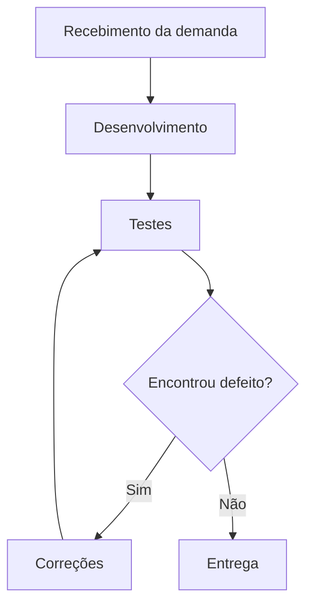

# Aula 14 - Qualidade de Processo

## 👥 Integrantes
- Bernardo Ginar de Carvalho — 782410122
- Bryan Laquimam Lübke Gonçalves — 782410011
- Filipe Silveira Maciel — 71901368
- Pedro Hasse Niemczewski — 781310203

## 1. Mapeamento do Processo

Analisando como o grupo tem trabalhado no LocalEats, chegamos no seguinte fluxo:

Basicamente, quando surge uma demanda (uma funcionalidade nova ou um ajuste no LocalEats), ela é discutida rapidamente entre os integrantes antes de alguém começar o desenvolvimento. Depois que o código é implementado, passa pela etapa de testes (manuais e automatizados), e só quando não há mais defeitos pendentes a funcionalidade é considerada pronta pra entrega.

Vale destacar que esse ciclo de testes e correções não é linear: às vezes uma funcionalidade volta pra correção mais de uma vez antes de ser aprovada, por isso o loop no diagrama.

## 2. Entradas, Atividades e Saídas

| Etapa | Entrada | Atividade | Saída |
|---|---|---|---|
| Recebimento da demanda | Necessidade/ideia de funcionalidade do LocalEats | Discussão e definição do escopo | Requisito definido |
| Desenvolvimento | Requisito definido | Implementação do código | Funcionalidade codificada |
| Testes | Funcionalidade codificada | Execução de testes manuais/automatizados | Lista de defeitos ou aprovação |
| Correções | Defeitos encontrados nos testes | Ajuste do código | Funcionalidade corrigida |
| Entrega | Funcionalidade validada | Integração/publicação no sistema | Funcionalidade disponível no LocalEats |

## 3. Reflexão sobre o Processo

**O processo utilizado pela equipe está claramente definido?**
Não totalmente. A gente sabe, na prática, quais são os passos (receber a demanda, desenvolver, testar, corrigir e entregar), mas isso não necessariamente estava escrito ou formalizado em nenhum lugar. Cada um aprendeu/se acostumou com o fluxo observando como os outros trabalhavam.

**Todos os integrantes seguem o mesmo fluxo de trabalho?**
Na maior parte das vezes sim, mas não se pode afirmar que sempre da mesma forma. Alguns integrantes testam a própria funcionalidade antes mesmo de avisar o resto do grupo, enquanto outros preferem já entregar para outra pessoa testar. Isso faz o processo variar um pouco dependendo de quem está desenvolvendo.

**Em quais etapas a qualidade é verificada?**
Principalmente na etapa de testes, onde se aplicou TDD, BDD e os testes manuais/automatizados das aulas anteriores. Existe também uma verificação informal durante o próprio desenvolvimento, quando alguém revisa o código antes de considerar terminado.

**Quais melhorias poderiam tornar o processo mais eficiente?**
- Deixar esse fluxo documentado de verdade.
- Padronizar quem revisa o que, pra não depender do estilo de cada integrante.
- Aumentar a cobertura de testes automatizados, reduzindo a dependência de teste manual repetitivo.
- Definir um critério mais claro de "pronto" antes de considerar a etapa de entrega concluída.

**Como a qualidade do processo impacta a qualidade do produto final?**
Um processo bagunçado ou informal demais tende a gerar retrabalho e deixar passar defeitos, porque cada um testa do seu jeito e algumas coisas acabam não sendo verificadas por ninguém. Quando o processo é bem definido, é mais fácil garantir que toda funcionalidade passe pelas mesmas etapas de verificação antes de chegar no usuário final, ou seja, a qualidade do LocalEats como produto depende diretamente de quão bem organizado é o processo que a equipe segue pra construí-lo.